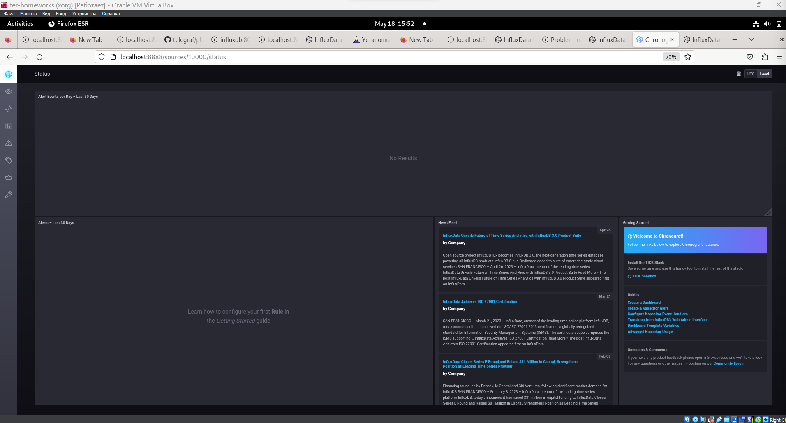
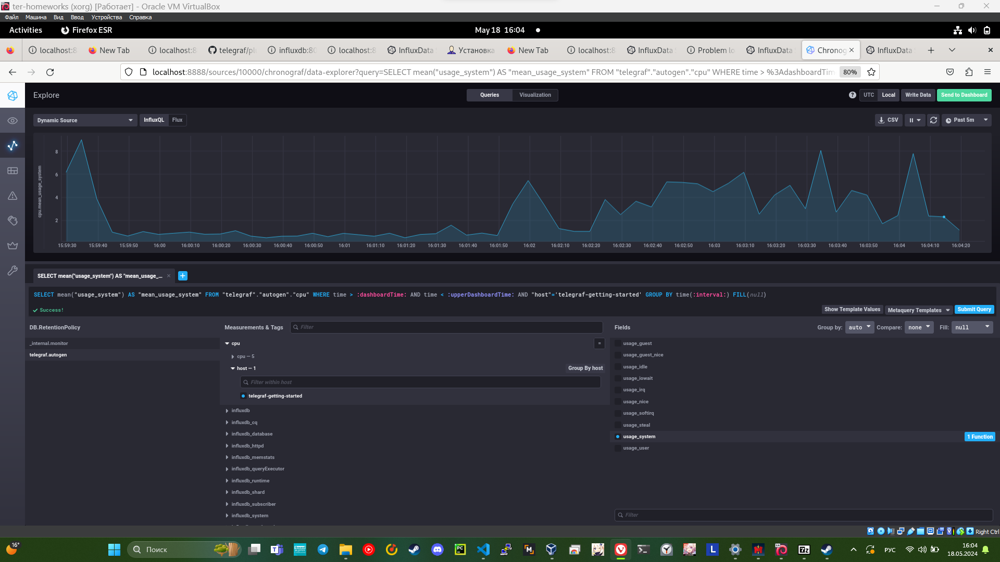
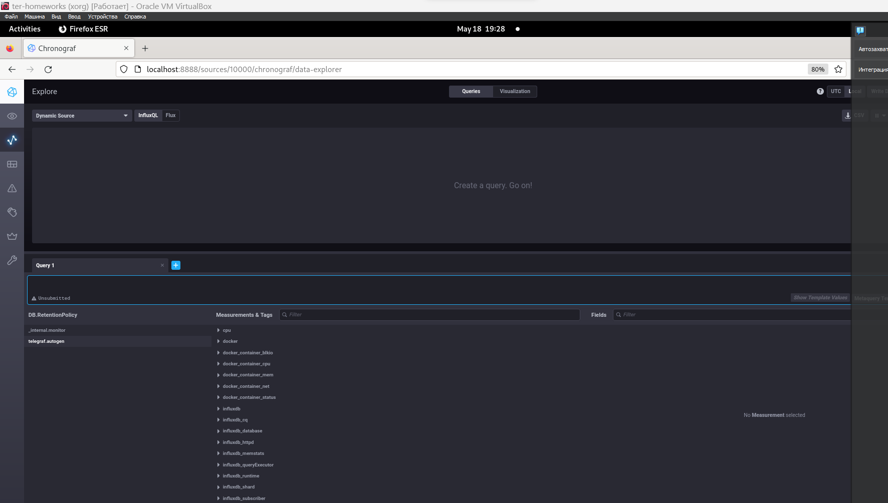

# monitoring-02-systems

# Домашнее задание к занятию "13.Системы мониторинга"

## Обязательные задания

1. Минимально необходимые метрики которые необходимо мониторить;

* Степень заполненности носителя информации,
* загрузку процессора,
* количество разных ошибок http.

#

2. Для мониторинга качества предоставления услуг необходимо внедрить метрику SLA.

#

3. Sentry или м.б Hawk

#

4. Вероятно ошибка заключается в том что в формуле не хватает 3хх ошибок.
   
#
5. -
  #
    Плюсы push:
   
    упрощение репликации данных в разные системы мониторинга или их резервные копии

    более гибкая настройка отправки пакетов данных с метриками

    UDP — это менее затратный способ передачи данных, из-за чего может возрасти
    производительность сбора метрик
#
    минусы push:

    сложнее выявить причину проблемы при инциденте
#
    Плюсы pull:

    легче контролировать подлинность данных

    можно настроить единый proxy server до всех агентов с TLS

    упрощённая отладка получения данных с агентов   
#
    Минусы pull: необходимо устанавливать клиент для получения метрик это не подходит для мониторинга мобильного приложения пользователя 

# 

6. Какие из ниже перечисленных систем относятся к push модели, а какие к pull? А может есть гибридные?

#
    Prometheus - pull
    TICK - push
    Zabbix - pull/push
    VictoriaMetrics - pull/push
    Nagios - push
#

7. 

#

#

8. 
#

#

9. 

#

#